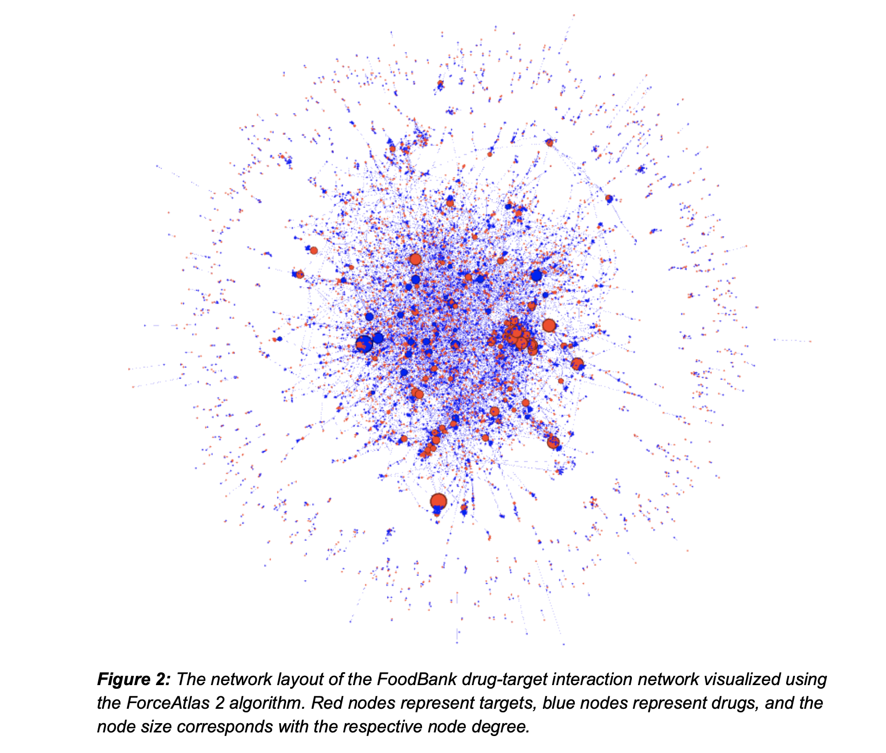

# DeepDrugRepurposer

### Files/filestructure
* raw data folder
* intermediated or miscillanious folder (I usually title misc_save, but whatever people think is best)
* (file or notebook for molecule embedding)
* (file or notebook for creating sample dataset)
* (file for model).py
* sometimes I make a python configuration size, titled config.py, to include metavaribles across multiple files. For instance, DIM_EMBED could be to streamline both embedding training and the model input. Just if we think it's useful

### Future...
* File for creating and partitining testing samples
* Folder for files to interact with web-server

# Summary

	In 2017, the international pharmaceutical industry generated over USD 934 billion in revenue and is expected to grow to over $1,170 billion in 2021. [1] Although people are willing to pay for pharmaceuticals, the cost associated with creating a new, breakthrough drugs are costly and often unsuccessful. Only 12% of drugs that are in clinical phase will be approved for market. [5] Drug development for a single drug costs USD 2.6 billion and 17 years to develop on average. [5] Development regulations drive over 10 percent of this cost, averaging USD 339.3 million dollars. The U.S. Food and Drug Administration (FDA) requires three phases of clinical testing: determining human safety and dosing (phase 1), initial reading of efficacy and side effects (phase 2), and larger clinical trials to determine the safety and efficacy in larger numbers (phase 3). [3] Bypassing any stage in this process could create cost and time savings for drug development and reduce the burden on consumers.

	Our project aims to develop a deep learning model and web portal for drug repurposing. Specifically, we seek to use information about the molecular structure of drugs and their target receptors to predict whether or not the two inputs react, i.e. a binary classifier. A breakthrough in drug-receptor repurposing could bypass toxicity stages in drug trials, and save tens of millions of dollars for a single effort to treat a disease. Additionally, there are other active efforts for drug-repurposing. However, we plan to use cutting edge deep learning techniques and a robust dataset to develop our drug structure based receptor model. Our primary datasets will be DrugBank for model development, PubChem for chemical metadata, and curated datasets for validation datasets. [10][6][4][9] After developing and testing our model, we plan to deploy it as a service using a web portal. A user will be able to enter a specific drug receptor listed in the database, and the portal will produce a possible new drug.

# Proposed Plan of Research

	Our project will take place over the full semester, and is divided up into two stages. Stage one will be data curation, data transformation, and model construction. Stage 2 will focus on model enhancement and deploying the model on the web.

## Stage 1 Research Plan (now - Oct. 21st)

	The first step in Stage 1 will be data curation and transformation. DrugBank outputs its database as a large xml data dump. The DrugBank dump contains information such as drugs, drug interactions, drug targets, and associated drug names. We will transform the raw data into a drug-target bipartite network. Not all of the drugs and targets have the appropriate chemical structure metadata, so we will use their cas-number to search PubChem and retrieve chemical SMILES, which are machine readable encodings of chemical structure. Once we have the chemical SMILES, we will convert the 1D structure into a 2D chemical structure using the RDKit python package.

	A challenge with using DrugBank is that it only provides true (label = 1) samples, and training a binary classifier requires both true and false examples. We plan on using network based negative sampling, which will randomly select negative samples that are farther than the largest-smallest cycle in the drug-target network. Target nodes that fall outside this distance from a drug node are assumed to not have a possible relationship because there has not been any relationship recorded in that distance. Prior studies describe the interaction between network proximity and drug discovery, although the research experiment conducted a different experiment than negative sampling. [2]

	The deep binary classification model we will implement will be based on recent developments in drug-target prediction. [8] The data will be input to the model as 1D or 2D structural encodings, and two separate sets of convolutional encoding layers will extract information. The encoding layers will be concatenated in after a pooling stage, and a series of dense/dropout layers will transform the concatenated encodings into the binary classification. We plan to use tensorflow in python for the implementation of the deep network.

## Stage 2 Research Plan (Oct. 21st - Nov. 18th)

	After the model is constructed, we will do deeper model validation and parameter tuning. We will use two hand curated datasets to validate the model. The datasets contain information on their interactions as a continuous kinase reaction scale, and we will need to pick values as cutoffs for binary classification. We plan on exploring the reaction scale distribution to select an appropriate cutoff. Using external datasets will be a powerful evaluation to determine our model effectiveness. Similar validations scores will suggest our model is learning scientific interactions, but a large discrepancy will show that there is a discrepancy between how our model performs on different datasets. We will use appropriate validations for classification such as precision, recall, and f1 scores.

	Finally, we aim to deploy our model as a web portal. From a business perspective, having a good model will not help pharmaceutical companies unless they have good access to potential drug substitutions. A web portal/search bar will enable a user to enter a drug target, and will recommend a new alternative. We will evaluate Heroku, Google Cloud Platform, and Amazon Web Services for hosting our website and model. We plan to use JavaScript and HTML for the user interface and web callbacks.

# Preliminary Results

	Our preliminary results focus on an exploratory analysis of DrugBank, as DrugBank is the training set for our model. We have constructed the DrugBank drug-target network, which has 6,835 drugs and 4,217 targets. The degree distribution shows that most drugs affect under 10 targets (Fig 1). However, a select few drugs have many targets. For instance, NADH, which affects 144 targets, is present in all living human cells and plays a role in generating energy. [7] People us supplements as medicine for mental clarity, alertness, memory, and even Alzheimer’s and dementia.

**_Figure 1: The degree distribution of the FoodBank drug-target interaction network. _**

	

A visualization of the networks shows that most drugs are connected in a central component (Fig 2). This shows our negative sampling method could be effective, as we have an average path length of 7.66. If we had a network with many separate components and a small average path length, the sampling technique would be rendered ineffective as we could ensure a long enough distance. The diameter, or longest-shortest path between two nodes, is 22 hops. The outer ring of the network shows drug-target interactions that do not connect to the central connected component.

**_Figure 2: The network layout of the FoodBank drug-target interaction network visualized using the ForceAtlas 2 algorithm. Red nodes represent targets, blue nodes represent drugs, and the node size corresponds with the respective node degree._**

Bibliography

    [1] Business Research Company. The Growing Pharmaceuticals Market: Expert Forecasts and Analysis. _Market Research Blog_ Available at: https://blog.marketresearch.com/the-growing-pharmaceuticals-market-expert-forecasts-and-analysis. 

    [2] Cheng, F. _et al._ Network-based approach to prediction and population-based validation of in silico drug repurposing. _Nature Communications_ **9,** (2018).

    [3] Commissioner, O. of the. Step 3: Clinical Research. _U.S. Food and Drug Administration_ Available at: https://www.fda.gov/patients/drug-development-process/step-3-clinical-research. 

    [4] Davis, M. I. _et al._ Comprehensive analysis of kinase inhibitor selectivity. _Nature Biotechnology_ **29,** 1046–1051 (2011).

    [5] Dimasi, J. A., Grabowski, H. G. &amp; Hansen, R. W. Innovation in the pharmaceutical industry: New estimates of R&D costs. _Journal of Health Economics_ **47,** 20–33 (2016).

    [6] Kim, S. _et al._ PubChem 2019 update: improved access to chemical data. _Nucleic Acids Research_ **47,** (2018).

    [7] Nadh: Uses, Side Effects, Interactions, Dosage, and Warning. _WebMD_ Available at: https://www.webmd.com/vitamins/ai/ingredientmono-1016/nadh. 

    [8] Nguyen &amp; Venkatesh, S. Prediction of drug–target binding affinity using graph neural networks. _bioRxiv_ (2019). Available at: http://dx.doi.org/10.1101/684662. 

    [9] Tang, J. _et al._ Making Sense of Large-Scale Kinase Inhibitor Bioactivity Data Sets: A Comparative and Integrative Analysis. _Journal of Chemical Information and Modeling_ **54,** 735–743 (2014).

    [10] Wishart, D. S. _et al._ DrugBank 5.0: a major update to the DrugBank database for 2018. _Nucleic Acids Research_ **46,** (2017).

