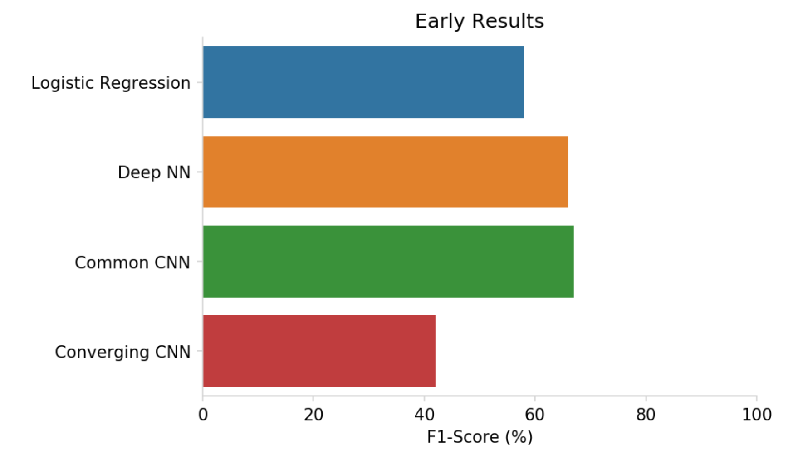
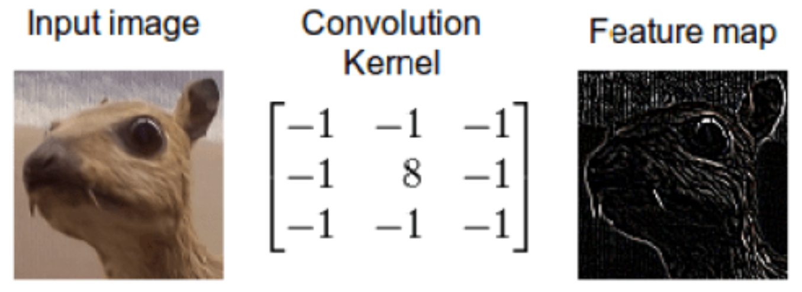
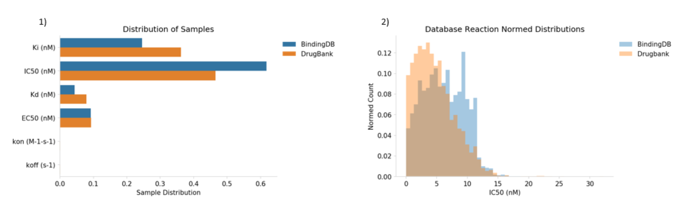

# DeepDrugRepurposer

## Authors: Sarthak Kothari, Noah Demoes, Omair Shafi Ahmed, Forrest Hooton

# Summary

In 2017, the international pharmaceutical industry generated over USD 934 billion in revenue and is expected to grow to over $1,170 billion in 2021. [1] Although people are willing to pay for pharmaceuticals, the cost associated with creating a new, breakthrough drugs are costly and
often unsuccessful. Only 12% of drugs that are in clinical phase will be approved for market. [3]
Drug development for a single drug costs USD 2.6 billion and 17 years to develop on average.
[3] Development regulations drive over 10 percent of this cost, averaging USD 339.3 million
dollars. The U.S. Food and Drug Administration (FDA) requires three phases of clinical testing:
determining human safety and dosing (phase 1), initial reading of efficacy and side effects
(phase 2), and larger clinical trials to determine the safety and efficacy in larger numbers (phase 3). [2] Bypassing any stage in this process could create cost and time savings for drug
development and reduce the burden on consumers. Even more, a breakthrough in
drug-receptor repurposing could bypass toxicity stages in drug trials, and save tens of millions
of dollars for a single effort to treat a disease.

We have developed a model that correctly classifies potential candidate drugs with an f1-score
of .73, we look to accomplish two objectives. The first is to optimize our model. We will conduct
hyper parameter tuning, evaluate cutoff thresholds for our binary classifier, and determine best
performance metric. The second is to build a web application. We will build a user interface (UI)
that customers and researchers can use to help find potential pre-approved drugs for
repurposing given a target receptor. This UI will be deployed as a web portal. A user will be
able to enter a specific drug receptor listed in the database, and the portal will produce a
possible new drug. By creating an inviting, intuitive UI researchers will be more likely to use this
platform to reduce production cost and hopefully increase the number of new drug gene cures.

# Proposed Plan of Research

Our project is taking place over the full semester, and is divided up into two stages. Stage 1 focused on data curation, data transformation, and model construction. Stage 2 will focus on model enhancement and deploying the model on the web. See preliminary results for the details of stage 1.

## Stage 2

Now that the model is developed we will do a deeper dive into model validation and parameter
tuning. Parameter tuning will consist of a grid search of candidate values for the following
hyperparameters: number of layers, number of neurons, type of activation function, number of
drop out layers, dropout layer percentage, number of epochs, batch size, and evaluation metric. Additionally, we will investigate the changing the inputs in the deep convolutional embedding model from embedding methods to simple encoding methods such as one hot encoding.

We will use BindingDB to validate the model. [4] The dataset contains information on their interactions as a continuous chemical reaction scale, and we will need to pick values as cutoffs for binary classification. We currently plan on using the IC50 reaction measurement with a cutoff of seven (see preliminary results for more detail). Similar validations scores will suggest our model is learning scientific interactions, but a large discrepancy will show that there is a discrepancy between how our model performs on different datasets. We will use appropriate validations for classification such as precision, recall, and f1 scores.

Finally, we aim to deploy our model as a web portal. From a business perspective, having a
good model will not help pharmaceutical companies unless they have good access to potential
drug substitutions. A web portal/search bar will enable a user to enter a drug target, and will
recommend a new alternative. We will evaluate Heroku, Google Cloud Platform, and Amazon
Web Services for hosting our website and model. We plan to use JavaScript and HTML for the
user interface and web callbacks. Additionally, we will need a database management system to
manage new drugs as well as new negative samples that users input. To do so we will use
Flask and mySQL.

# Preliminary Results
We began with a baseline logistic classification model as a well-known benchmark to help use understand the performance of more advanced models. We then developed the three deep networks discussed prior. We chose the F1-score as the validation method for our models, as the F1-score incorporates both precision and recall. Logistic model had a F1-score of ~58%, whereas the Deep NN model was performing much better with an F1 score of ~76%. Even though we achieved similar results in the common CNN model (F1-score of ~68%), it only predicted True for all samples, hence we do not currently consider it a well-performing model. Although the converging CNN performed much worse than all the other models, it classified examples as both True and False unlike the common CNN model. The higher F1-score for the DeepNN compared to logistic regression indicates non-linear boundaries. We originally anticipated higher accuracies using the CNN models than the DeepNN, however the CNNs failed to perform as per our expectations. A possible explanation is our use of embeddings as input to the CNNs, which already capture patterns in the raw data.

Figure 1: Shows the early F1-score results of models on the test dataset.

An important choice we made in the project was the feature engineering concerning the gene and chemical fingerprints. With the preliminary literature review, we decided to convolve over fingerprint embeddings. However, later into the project, the theoretical underpinnings of convolving over chemical fingerprint embeddings became more unclear. To that end, we decided to dig deeper about the interaction of convolutions and embeddings and modify our model appropriately.

As shown in Fig 2, a convolutional layer is used to perform a filtering operation on an image. In a deep convolutional neural network, these filters are learned over multiple examples, learning to filter high level features, in every layer of convolution, that are important for the classification task at hand, from the underlying data.

Figure 2: An example of a convolutional filter that extracts the shape of an animal’s head. This filter is then used by layers downstream to further extract higher level features, or use this directly to classify this image.

Alternatively, word vectors use the same high level structural information of the underlying data, but instead map that information into a lower dimensional latent space. In this latent space the distance between two vectors is indicative of the similarities of their high dimensional features. This is useful in classifying the data downstream as a classifies can learn to classify images based on their distances. However, we theorize that embedding our fingerprint vectors into a high dimensional space masks the high level structural information that a convolutional layer can filter over which likely reduces the effectiveness of the convolution layer. We plan to evaluate further in part two of the project.

In addition to the DrugBank testing dataset, we also want to use a validation set external to DrugBank. [5] If the model produces similar results on the external datasets, we can be more confident that our model is capturing patterns related to chemical-gene relationships rather than only learning how to capture intricacies of DrugBank. We choose to use BindingDB because of its large number of samples and pre-listed chemical SMILES information and gene information. However, BindingDB lists many chemical-gene interactions, and does not label which reactions are actually used as drugs. Therefore, we will need to assign labels to the samples as which pairs represent drugs (samples of label 1, ‘drug’), and which do not have a drug relationship (samples of label 0, ‘not drug’).

Figure 3: 1) The distribution of chemical reaction measurements for all of Binding DB and listed DrugBank samples. 2) The normalized IC50 measurement distribution for all of Binding DB  and listed Drugbank samples.

We choose to create a threshold for chemical reaction measurements to create ‘drug’ and ‘not drug’ samples. The measurement units of Binding DB indicate stronger reactions as the measurement decreases, and weaker reactions as the measurement increases. A sample is labeled as a drug interaction if the chemical measurement falls below the threshold, and not a drug interaction if it falls above. We merged the BindingDB and DrugBank datasets contained matches in drug-gene interactions, and observed the distribution of the databases to choose a threshold. To complicate matters, BindingDB records chemical-gene interactions with several different types of reaction measurements. Both databases listed measurements in units of IC50 most frequently (Fig 3.1), therefore we chose to pick samples with entries using the IC50 measurement. We compared the distributions for BindingDB and DrugBank in Fig 3.2. This comparison shows a distinct dropoff for the number of drugs at an IC50 value of seven, therefore we will begin with seven as our threshold. If we use a threshold of seven, then BindingDB produces 132,004 drug relationships and 922,635 non-drug relationships.

# Bibliography
[1] Business Research Company. “The Growing Pharmaceuticals Market: Expert Forecasts and Analysis.” Market Research Blog, blog.marketresearch.com/the-growing-pharmaceuticals-market-expert-forecasts-and-analysis.

[2] Commissioner, Office of the. “Step 3: Clinical Research.” U.S. Food and Drug Administration, FDA, www.fda.gov/patients/drug-development-process/step-3-clinical-research.

[3] Dimasi, Joseph A., et al. “Innovation in the Pharmaceutical Industry: New Estimates of R&D Costs.” Journal of Health Economics, vol. 47, 2016, pp. 20–33., doi:10.1016/j.jhealeco.2016.01.012.

[4] Gilson, Michael K., et al. “BindingDB in 2015: A Public Database for Medicinal Chemistry, Computational Chemistry and Systems Pharmacology.” Nucleic Acids Research, vol. 44, no. D1, 2015, doi:10.1093/nar/gkv1072.

[5] Wishart, David S, et al. “DrugBank 5.0: a Major Update to the DrugBank Database for 2018.” Nucleic Acids Research, vol. 46, no. D1, 2017, doi:10.1093/nar/gkx1037.