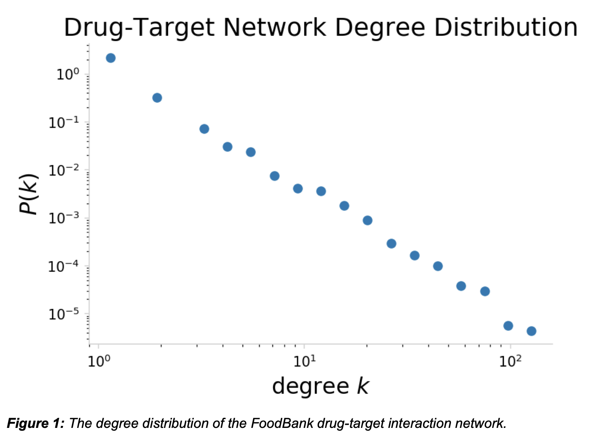

# DeepDrugRepurposer

## Authors: Sarthak Kothari, Noah Demoes, Omair Shafi Ahmed, Forrest Hooton

# Summary

In 2017, the international pharmaceutical industry generated over USD 934 billion in revenue and is expected to grow to over $1,170 billion in 2021. [1] Although people are willing to pay for pharmaceuticals, the cost associated with creating a new, breakthrough drugs are costly and 
often unsuccessful. Only 12% of drugs that are in clinical phase will be approved for market. [5] 
Drug development for a single drug costs USD 2.6 billion and 17 years to develop on average. 
[5] Development regulations drive over 10 percent of this cost, averaging USD 339.3 million 
dollars. The U.S. Food and Drug Administration (FDA) requires three phases of clinical testing: 
determining human safety and dosing (phase 1), initial reading of efficacy and side effects 
(phase 2), and larger clinical trials to determine the safety and efficacy in larger numbers (phase 3). [3] Bypassing any stage in this process could create cost and time savings for drug 
development and reduce the burden on consumers. Even more, a breakthrough in 
drug-receptor repurposing could bypass toxicity stages in drug trials, and save tens of millions 
of dollars for a single effort to treat a disease. 

We have developed a model that correctly classifies potential candidate drugs with an f1-score 
of .73, we look to accomplish two objectives. The first is to optimize our model. We will conduct 
hyper parameter tuning, evaluate cutoff thresholds for our binary classifier, and determine best 
performance metric. The second is to build a web application. We will build a user interface (UI) 
that customers and researchers can use to help find potential pre-approved drugs for 
repurposement given a target receptor. This UI will be deployed as a web portal. A user will be 
able to enter a specific drug receptor listed in the database, and the portal will produce a 
possible new drug. By creating an inviting, intuitive UI researchers will be more likely to use this 
platform to reduce production cost and hopefully increase the number of new drug gene cures.

# Proposed Plan of Research

Our project is taking place over the full semester, and is divided up into two stages. Stage 1 focused on data curation, data transformation, and model construction. Stage 2 will focus on model enhancement and deploying the model on the web. See preliminary results for the details of stage 1.

## Stage 2 Research Plan (Oct. 21st - Nov. 18th)

Now that the model is developed we will do a deeper dive into model validation and parameter 
tuning. Parameter tuning will consist of a grid search of candidate values for the following 
hyperparameters: number of layers, number of neurons, type of activation function, number of 
drop out layers, dropout layer percentage, number of epochs, batch size, and evaluation metric. Additionally, we will investigate the changing the inputs in the deep convolutional embedding model from embedding methods to simple encoding methods such as one hot encoding. 

We will use BindingDB to validate the model. The dataset contains information on their interactions as a continuous chemical reaction scale, and we will need to pick values as cutoffs for binary classification. We currently plan on using the IC50 reaction measurement with a cutoff of seven (see preliminary results for more detail). Similar validations scores will suggest our model is learning scientific interactions, but a large discrepancy will show that there is a discrepancy between how our model performs on different datasets. We will use appropriate validations for classification such as precision, recall, and f1 scores.

Finally, we aim to deploy our model as a web portal. From a business perspective, having a 
good model will not help pharmaceutical companies unless they have good access to potential 
drug substitutions. A web portal/search bar will enable a user to enter a drug target, and will 
recommend a new alternative. We will evaluate Heroku, Google Cloud Platform, and Amazon 
Web Services for hosting our website and model. We plan to use JavaScript and HTML for the 
user interface and web callbacks. Additionally, we will need a database management system to 
manage new drugs as well as new negative samples that users input. To do so we will use 
Flask and mySQL.

# Preliminary Results

	The preliminary results can be found at this link. The web platform is working and is linked to 
our database. If you input a drug that is a pre-approved drug, aka it exists in the database than 
the website will return a potential drug. If that drug does not exist then it will return an error 
Message. 

	

# Bibliography
[1] Business Research Company. The Growing Pharmaceuticals Market: Expert Forecasts and Analysis. Market Research Blog Available at: https://blog.marketresearch.com/the-growing-pharmaceuticals-market-expert-forecasts-and-analysis. 

[2] Cheng, F. et al. Network-based approach to prediction and population-based validation of in silico drug repurposing. Nature Communications 9, (2018).

[3] Commissioner, O. of the. Step 3: Clinical Research. U.S. Food and Drug Administration Available at: https://www.fda.gov/patients/drug-development-process/step-3-clinical-research. 

[4] Davis, M. I. et al. Comprehensive analysis of kinase inhibitor selectivity. Nature Biotechnology 29, 1046–1051 (2011).

[5] Dimasi, J. A., Grabowski, H. G. &amp; Hansen, R. W. Innovation in the pharmaceutical industry: New estimates of R&D costs. Journal of Health Economics 47, 20–33 (2016).

[6] Kim, S. et al. PubChem 2019 update: improved access to chemical data. Nucleic Acids Research 47, (2018).

[7] Nadh: Uses, Side Effects, Interactions, Dosage, and Warning. WebMD Available at: https://www.webmd.com/vitamins/ai/ingredientmono-1016/nadh. 

[8] Nguyen &amp; Venkatesh, S. Prediction of drug–target binding affinity using graph neural networks. bioRxiv (2019). Available at: http://dx.doi.org/10.1101/684662. 

[9] Tang, J. et al. Making Sense of Large-Scale Kinase Inhibitor Bioactivity Data Sets: A Comparative and Integrative Analysis. Journal of Chemical Information and Modeling 54, 735–743 (2014).

[10] Wishart, D. S. et al. DrugBank 5.0: a major update to the DrugBank database for 2018. Nucleic Acids Research 46, (2017).

